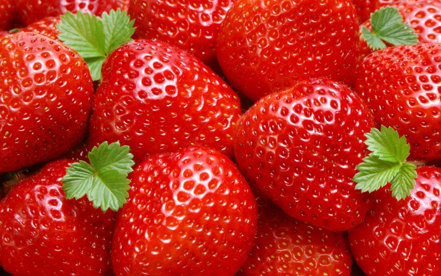

<html>
	<head>
		<title> Selman Sarı </title>
	</head>
	<body style ="background:url(manzara.jpg)">
		
		

		
		<table>
			<tr>
				<td><a href="hakkimda.html">Hakkımda</a></td>
				<td><a href="ogrenim.html">Öğrenim</a></td>
				<td><a href="projeler.html">Projeler</a></td>
				<td><a href="iletisim.html">İletişim</a></td>
			</tr>
		</table>	
	</body>

</html>
